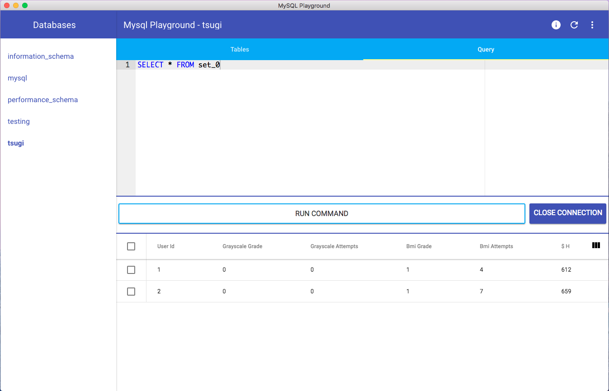

### MySQL Playground

This is a super basic app for querying a database. I wrote it this morning in a couple of hours as a proof of concept so don't expect a rich feature set yet. Set up with `bower install && npm install` then run `npm start`. You'll have to edit the user in `app/index.html` for the moment, but when I get around to it I'll add a UI modal for logging into the database proper.  

### TODO
- [ ] Add login modal to ask for username, password, connection, etc
- [x] Add ace editor to query tab (as opposed to a textarea)
- [ ] Migrate to ES6 (benefits of keeping es5 Polymer classes???)
- [ ] Add footer to table with options (drop/delete, alter, etc)
- [x] add sidebar to choose between multiple databases
- [ ] Add ability to click on table and automatically open query (e.g. `SELECT * FROM table_name`)
